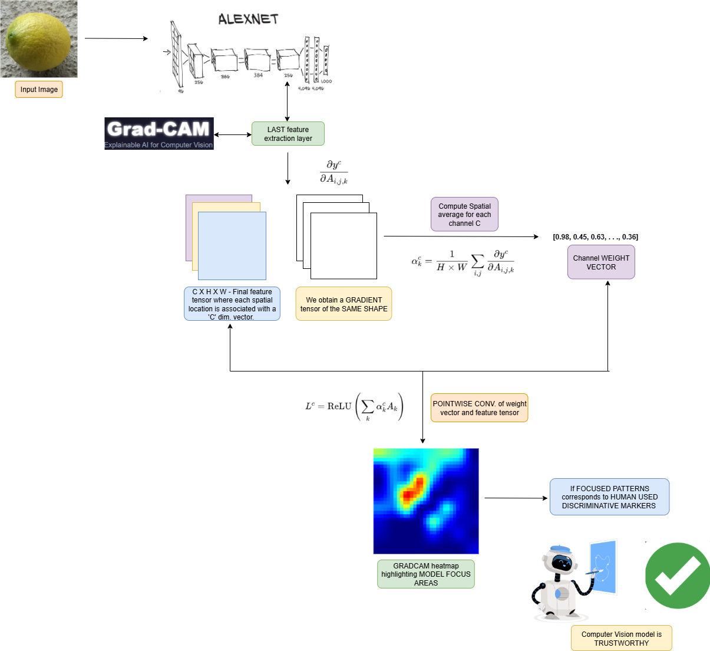

# 🍋🤖 AlexNet-GradCAM-For-Investigating-Dataset-Induced-Biases-For-Lemon-Quality-Sorting 🔍
This repo demonstrates the use of GradCAM visualizations to investigate if a model used for a performance critical task such as fruit sorting (AlexNet in this case) is free from dataset induced biases especially due to background textures etc. 

# Demo 👇
<video src="demo.mp4" controls width="640"></video>
[[Link to Demo]](https://youtu.be/9cGBaeQ9GtE "Click to watch")

# Overview of the pipeline


## 🚀 Features

* **AlexNet for lemon quality classification**: **Transfer learning** for a simple Binary Classification problem involving classes **Fresh/Rotten**
* **Grad-CAM**: Applied to the **last feature extraction layer of AlexNet** generates a **heatmap** which encodes the degree of influence each region in the image had on **label assignment**.
* **Interactive Streamlit UI**: Enables the user to **upload an image** and **choose the class** for which he wishes to observe Grad-Cam Visualizations. 
---

## 📂 Project Structure

```bash
.
├── AlexNet_Finetune.ipynb/              # Loads AlexNet from PyTorch model zoo and finetunes it on the lemon quality dataset.
├── Model_Testing_GradCAMViz.ipynb/          # infers from the finetuned AlexNet model and demonstrates GradCAM use on the final feature extraction layer.
├── requirements.txt      # Python dependencies.
├── demo.py            # An interactive UI based GradCAM visualizer.
├── dataset/                   # Lemon quality Bi-Class dataset
       ├── train
       ├── val
       ├── test
├── frozen_model.pth  # Finetuned AlexNet model weights.
```

## 🔧 Running Dependency

To download the **Lemon Quality dataset** click on this link [[Link to download]]([https://drive.google.com/drive/folders/1duEVC9FWB5z3H0I6rEtV33JzSudWob5Q?usp=drive_link]).
To download the **Finetuned Model Weights** click on this link [[Link to download]]([https://drive.google.com/drive/folders/1duEVC9FWB5z3H0I6rEtV33JzSudWob5Q?usp=drive_link]).
Place the dataset and weights file inside your project directory. 

   ```bash
   ├── dataset/
       ├── train
       ├── val
       ├── test
   ├── frozen_model.pth
   ```
## 📜 License

This project is licensed under the [MIT License](LICENSE).

---

## 🙌 Acknowledgements

* [AlexNet]([https://kpzhang93.github.io/MTCNN_face_detection_alignment/](https://proceedings.neurips.cc/paper_files/paper/2012/file/c399862d3b9d6b76c8436e924a68c45b-Paper.pdf)) - The AlexNet **Research Paper**. 
* [GradCAM]([http://dlib.net/](https://arxiv.org/abs/1610.02391)) - The GradCAM**Research Paper**.
---

### ⭐ If you find this project helpful, don’t forget to star the repo!
